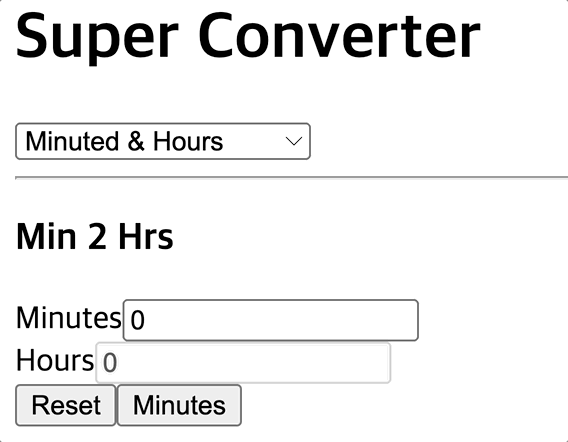

# React-Converter
https://jun-isaac.github.io/React-Converter/

-----------------
## 🧑🏻‍💻 구현 목표

- [x] React를 활용해서 단위변환기 제작
- [x] 시간을 분으로, 분을를 시간으로 변환
- [x] km를 m로, m를 mk로 변환
- [x] 섭씨를 화씨로, 화씨를 섭씨로 변환
- [x] kg를 파운드로, 파운드를 kg로 변환
- [ ] css 수정 필요

-----------------
## 🖼 메인프레임

* input안에 값을 넣으면 값이 변환 됩니다.

------------------
## 📕 배운 것

* react는 jsx이기 때문에 html에 있는 함수를 사용하면 안된다.
 
ex) class = className으로 for = htmlFor로 바꿔서 사용해야 함.

  

### 🕹 단위 입력시 변환 시켜 줌

 

### 🕹 반대로 변환도 가능

 

### 🕹 다양한 단위 변환 가능

  

----

## 사용 라이브러리
|React|
|---|